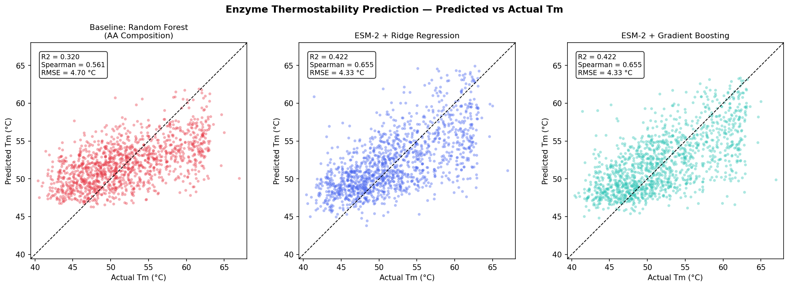
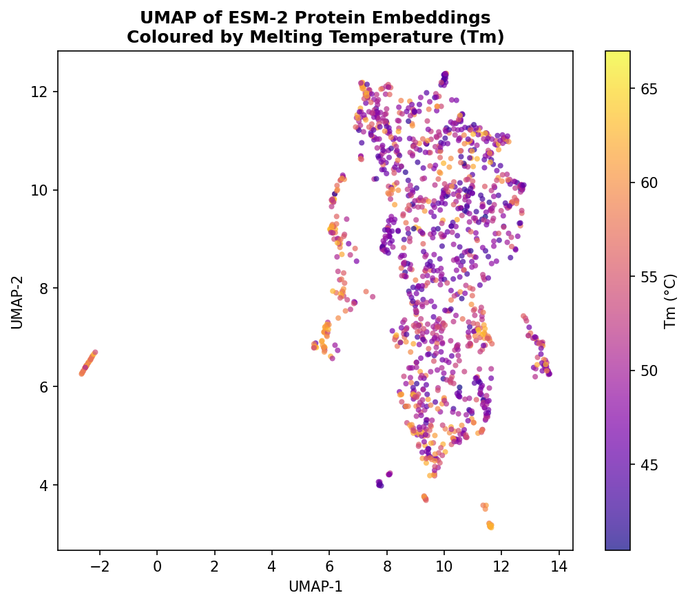
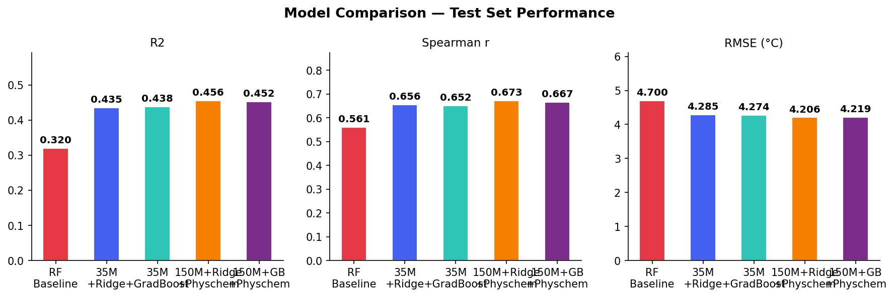

# Enzyme Thermostability Prediction with ESM-2 Protein Language Model

Predicting enzyme melting temperature (Tm) from amino acid sequence using Meta's ESM-2 protein language model and supervised regression.

## Overview

Thermostability is a critical property in enzyme engineering. Industrially relevant enzymes must retain activity under process conditions (elevated temperature, pH, solvent exposure). Experimental measurement of Tm is resource-intensive; computational prediction from sequence alone enables rapid pre-screening.

This project benchmarks ESM-2 sequence embeddings against a hand-crafted amino acid composition baseline on the AI4Protein thermostability dataset (7,029 proteins, Tm range: 40–67°C).

## Results

| Model | R² | Spearman ρ | RMSE (°C) |
|---|---|---|---|
| Baseline: Random Forest (AA composition) | 0.320 | 0.561 | 4.700 |
| **ESM-2 (35M) + Ridge Regression** | **0.422** | **0.655** | **4.334** |
| ESM-2 (35M) + Gradient Boosting | 0.416 | 0.640 | 4.357 |

ESM-2 embeddings improve Spearman correlation by **+17% relative** over amino acid composition features, demonstrating that transformer-derived sequence representations capture thermodynamic information beyond simple residue statistics.

## Figures

**Predicted vs Actual Tm — three models**



**UMAP of ESM-2 embeddings coloured by Tm**



The UMAP projection reveals continuous Tm-correlated structure in the ESM-2 embedding space — proteins with similar Tm values cluster together, consistent with the model capturing thermodynamic signal in its representations.

**Model comparison**



## Methodology

### Dataset
- **Source:** [AI4Protein/Thermostability](https://huggingface.co/datasets/AI4Protein/Thermostability) (HuggingFace)
- 7,029 proteins — 5,054 train / 639 validation / 1,336 test
- Target: melting temperature Tm (°C), range 40.2–66.9°C

### Embeddings
- **Model:** `facebook/esm2_t12_35M_UR50D` (35M parameters, 12 layers, 480-dim hidden)
- **Pooling:** Mean pooling over non-padding token positions (outperforms [CLS] pooling for protein-level tasks)
- **Truncation:** max 512 tokens; batch size 32

### Regression heads
- **Ridge Regression:** alpha tuned on validation set (best: 1000); features standardized with `StandardScaler`
- **Gradient Boosting:** 300 estimators, learning rate 0.05, max depth 4, subsample 0.8
- **Baseline RF:** 200 estimators on 20-dimensional amino acid frequency vectors

### Evaluation
- Spearman correlation (primary — rank-based, standard for protein fitness prediction benchmarks)
- R², RMSE, MAE on held-out test set

## Motivation

This project is a direct extension of my published research on ML-driven bioprocess optimization. Prior work applied ANN, Random Forest, and Bayesian optimization to fermentation and enzymatic production systems. This project extends that framework to protein-level sequence modelling using transformer-based representations; bridging tabular bioprocess ML with modern protein language models.

The thermostability problem is directly relevant to industrial enzyme engineering for fermentation and bioconversion processes, including lipase production systems studied in my published research.

## Setup

```bash
pip install torch --index-url https://download.pytorch.org/whl/cpu
pip install transformers datasets scikit-learn scipy matplotlib umap-learn
```

## Usage

```bash
python 01_prepare_data.py          # Download and cache dataset
python 02_extract_esm_embeddings.py  # Extract ESM-2 embeddings (~10 min CPU)
python 03_train_and_evaluate.py    # Train models, print metrics
python 04_visualize.py             # Generate figures to results/
```

Or run the full pipeline:

```bash
python run_pipeline.py
```

## Repository Structure

```
enzyme-thermostability/
├── 01_prepare_data.py
├── 02_extract_esm_embeddings.py
├── 03_train_and_evaluate.py
├── 04_visualize.py
├── run_pipeline.py
├── data/
│   ├── train.csv / val.csv / test.csv
│   ├── embeddings_{split}.npy
│   └── labels_{split}.npy
└── results/
    ├── metrics.csv
    ├── predictions.csv
    ├── model_info.json
    ├── fig1_predicted_vs_actual.png
    ├── fig2_umap_embeddings.png
    └── fig3_model_comparison.png
```

## Author

**Ogaga Maxwell Okedi**
-MS Computer Science, University of Texas at Dallas (in view)
-MS Chemical Engineering, FAMU–FSU College of Engineering
-B.Sc Chemical Enginering
